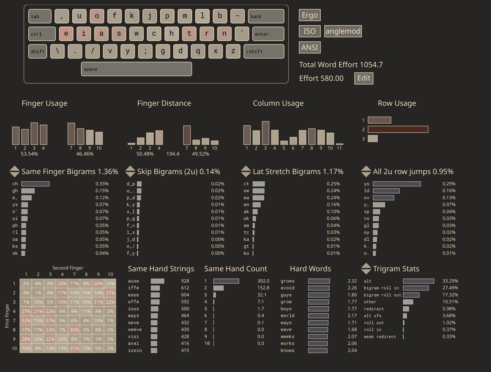
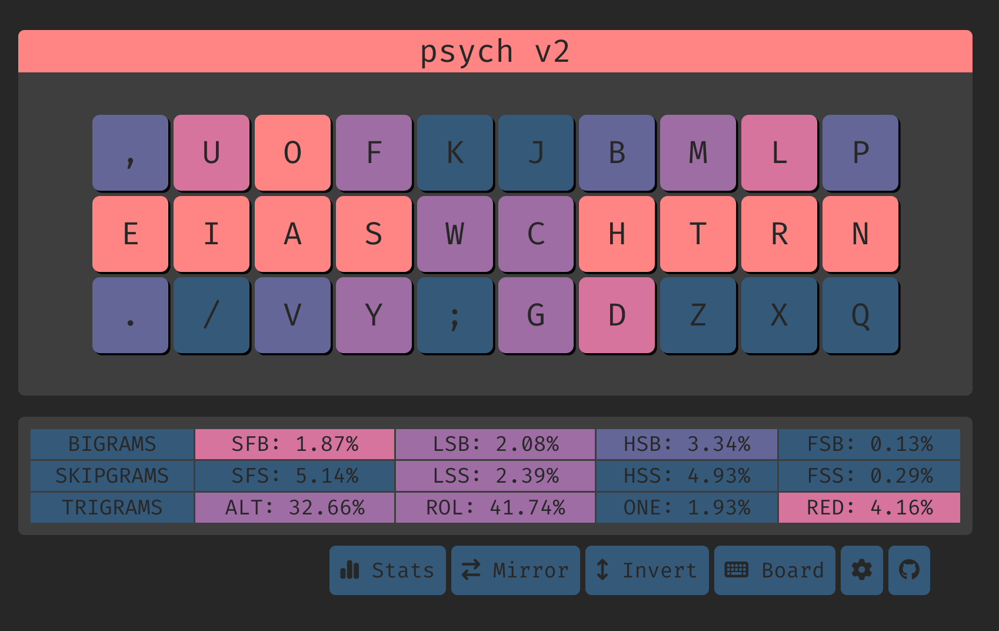

# Psych V2 (Previously Kenshin 剣心)



[link (select "angle mod")](https://cyanophage.github.io/playground.html?lan=english&layout=%2Cuofkjpmlb-eiaswchtrn%27.%2Fvy%3Bgdqxz%5C%5E&mode=iso)


## Features
- [angle modded](https://colemakmods.github.io/ergonomic-mods/angle.html) for row staggered (aka standard) keyboards
- same hand h/j/k/l (k is technically on the right hand, but next to j)
- sfbs are very alt-fingerable
- low SFS (4.86% vs kuntem 4.87% on shai)
- comparatively high inrolls (pro version 27.11% vs rain 32.26% on shai) 

Psych is basically kenshin, but with c moved to the right index. This blows up sfbs by a lot but they are all easily altable.

## SFS tips
The SFS is already decent, but I've taken one step further by hitting the letter "d" with my RM finger, whenever d is the start of a word. This makes typing "deploy", "decode", "depends" a lot nicer.

As a result, when there's a sequence of letters that are like d->[mtv]->[rlq] (0.0194%), I would hit [mtv] with my RR finger and [rlq] with my RP, and the fingers reset when a redirect breaks the chain.

For eg, when typing "development":
- d: RM
- v: RR
- l: RP
- p: RI (resets)
- m: RM 
- and so on.

Examples of `^d([^jkchpdrlqbnx]*[mtv])+([^jkchpdmtvbnx]*[rlq])+` in SHAI:
```
157,676 / 81,369,938 words (0.194%)

development     (18764)
digital         (12488)
details         (10260)
develop         (9856)
developed       (9197)
determine       (7539)
developing      (6628)
district        (5596)
detailed        (4696)
determined      (4242)
```

In this approach, there will be a 10% chance of having pinky bigrams, which I think is acceptable.

Examples of `^d([^jkchpdrlqbnx]*[mtv])+([^jkchpdmtvbnx]*[rlq])+([^jkchpdmtvrlq]*[bnx])+` in SHAI:
```
11,689 / 81,369,938 words (0.014%)

distribution    (3496)
distributed     (1642)
distribute      (1020)
detailing        (642)
destroying       (638)
disturbing       (602)
distributor      (530)
distributing     (424)
distributions    (359)
distribution.    (351)
```


**Another, probably the better way is to memorize certain common words like deploy, depends, decode, and only use RM "d" for those words.**

  
## Top 10 SFBS

```
ch    0.482% -> altable
gh    0.235% -> altable
ui    0.104% 
ys    0.103% -> altable
n.    0.092%
rl    0.074%
oa    0.072%
ks    0.072% -> altable
sk    0.051% -> quite altable
sy    0.043% -> quite altable
```

## Cmini overview

```
  , u o f k  j b m l p  
  e i a s w  c h t r n '
   . / v y ;  g d z x q  

SHAI:
  Alt: 30.00%
  Rol: 43.85%   (In/Out: 27.11% | 16.74%)
  One:  1.38%   (In/Out:  0.37% |  1.02%)
  Rtl: 45.23%   (In/Out: 27.48% | 17.75%)
  Red:  3.98%   (Bad:     0.28%)

  SFB: 1.88%
  SFS: 4.86%    (Red/Alt: 1.30% | 3.56%)

  LH/RH: 53.77% | 46.23%
```


## Cmini Fingerspeed

```
SHAI:
Unweighted Speed
    LP: 2.799
    LR: 5.859
    LM: 3.743
    LI: 14.637
    RI: 21.513
    RM: 2.701
    RR: 3.370
    RP: 2.403

Weighted Speed
    LP: 1.866
    LR: 1.627
    LM: 0.780
    LI: 2.661
    RI: 3.911
    RM: 0.563
    RR: 0.936
    RP: 1.602
```


## Keysolve




# Readings
- https://semilin.github.io/blog/2023/layout_quality.html
- https://getreuer.info/posts/keyboards/alt-layouts/index.html#which-alt-keyboard-layout-should-i-learn
- https://bit.ly/layout-doc-v2
- https://cyanophage.github.io/
