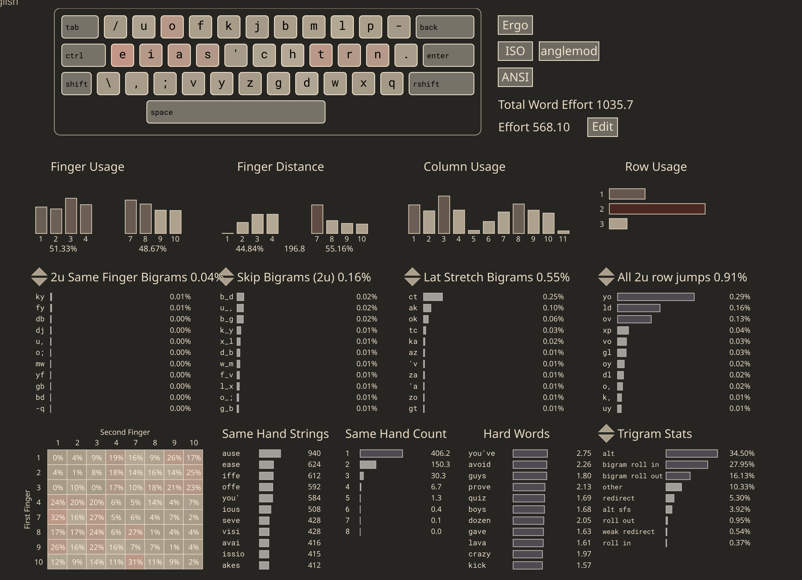
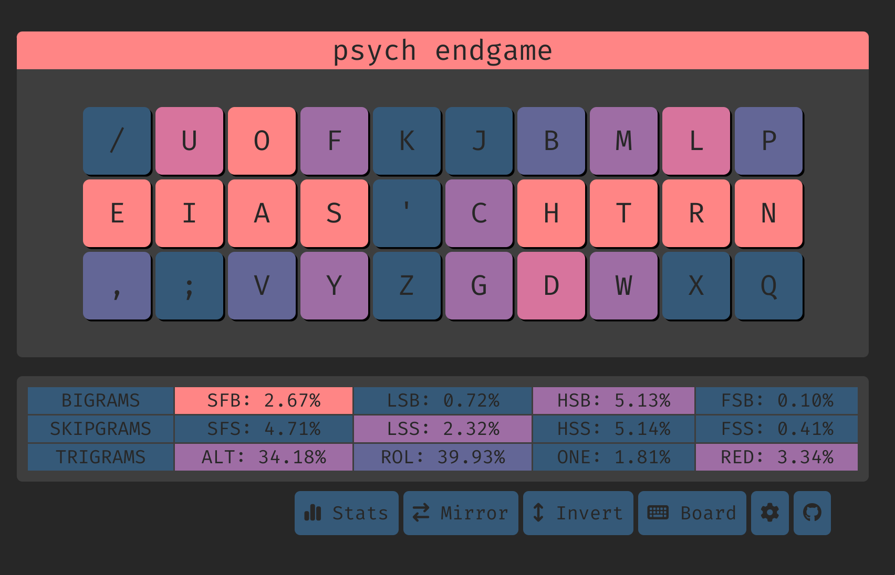

# Psych (Previously Kenshin 剣心)



[link (select "angle mod")](https://cyanophage.github.io/playground.html?lan=english&layout=%2Fuofkjbmlp-eias%27chtrn.%2C%3Bvyzgdwxq%5C%5E&mode=iso)

## Design choices
- Prefer sfbs on index fingers
- Prefer low sfs over sfbs because the latter can be alted more easily
- Having hjkl in natural positions 

## Features
- [angle modded](https://colemakmods.github.io/ergonomic-mods/angle.html) for row staggered (aka standard) keyboards
- same hand h/j/k/l (k is technically on the right hand, but next to j)
- sfbs are very alt-fingerable
- low SFS (4.74% vs kuntem 4.87% on shai)
- high rolls, especially inrolls

## Cmini

``` 
  / u o f k  j b m l p  
  e i a s '  c h t r n .
   , ; v y z  g d w x q  

SHAI:
  Alt: 31.15%
  Rol: 43.07%   (In/Out: 27.37% | 15.69%)
  One:  1.32%   (In/Out:  0.37% |  0.95%)
  Rtl: 44.39%   (In/Out: 27.75% | 16.64%)
  Red:  3.88%   (Bad:     0.30%)

  SFB: 1.83%
  SFS: 4.74%    (Red/Alt: 0.94% | 3.80%)

  LH/RH: 51.23% | 48.77%
```

## Top 10 sfbs

```
ch    0.482% -> altable
gh    0.235% -> altable
's    0.150% -> altable
ui    0.104%
ys    0.103% -> altable
n.    0.092%
rl    0.074%
oa    0.072%
ks    0.072% -> altable
tw    0.068%
```

## Sfbs with alt-fingerings

**0.79%**

``` c
>>> 1.83 - 0.482 - 0.235 - 0.150 - 0.103 - 0.072
0.788
```

## Keysolve




# Readings
- https://semilin.github.io/blog/2023/layout_quality.html
- https://getreuer.info/posts/keyboards/alt-layouts/index.html#which-alt-keyboard-layout-should-i-learn
- https://bit.ly/layout-doc-v2
- https://cyanophage.github.io/


