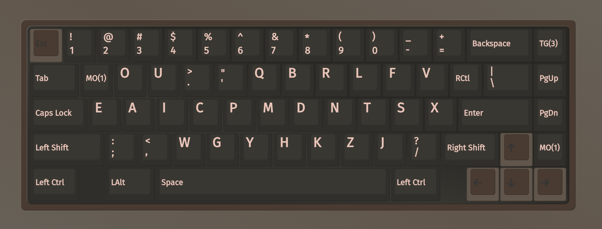
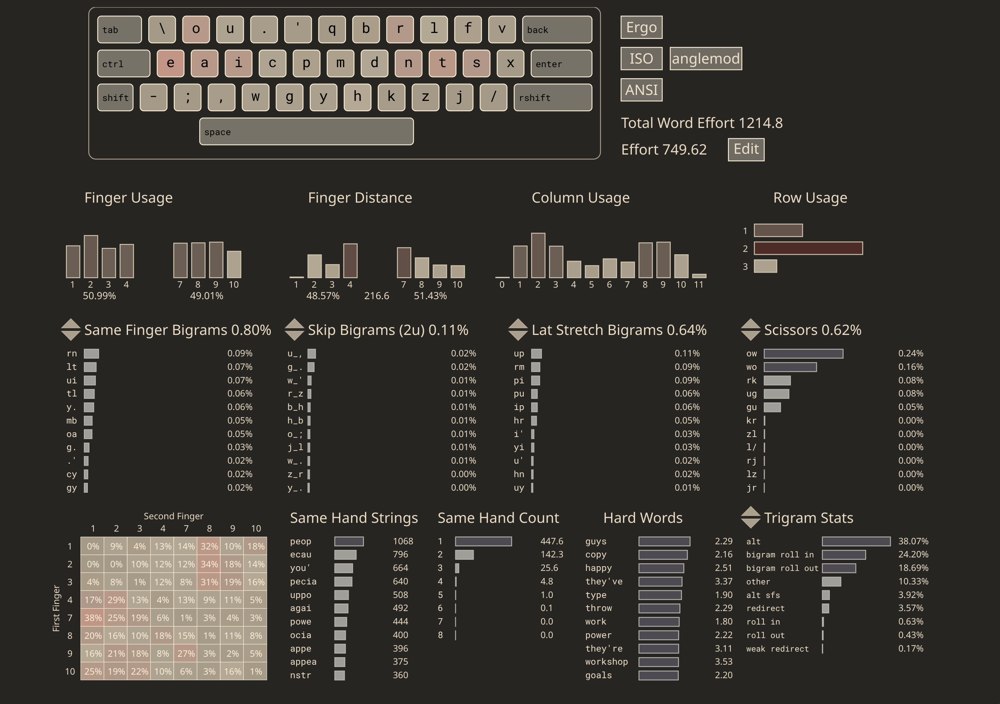
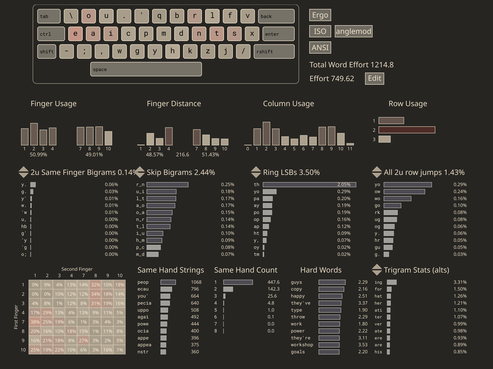

# Deuterium layout



## Cyanophage layout analyzer

---

 
[link (select "angle mod")](https://cyanophage.github.io/playground.html?lan=english&layout=%5Cou.%27qbrlfveaicpmdntsx%3B%2Cwgyhkzj%2F-%5Eback&mode=iso&thumb=l)

---

## Why?
- Quite rolly (inrolls), it has the best rolling feel out of all the homerows that I have tried, and is most similar to sturdy
- Low 2u sfs and 2u row jumps
- Alt-fingerable sfbs (`ui`, `oa`, `rn`)

## Layout quirks

#### Bidextrous `Y`
`y` is assigned to either index finger depending on letter sequence. `y` interacts with nearly all english letters and this eliminates a lot of same finger bigram/skipgram problems

#### `hjkl` clustering
Having hjkl on the same hand in a relatively natural positions (vim + tiling window managers)

#### `w` and `t` positions

Helps reducing skip rolls (`iew`, `wei`, `m_nt`). By sandwiching `t` with `n` and `s`, you get comfortable rolls at the cost of some redirects.


#### Shifts frequent letters on outer columns/pinky
This allows the index fingers to move inward and reach inner column letters such as `y`, `p` and `x` more easily. 

#### `E` being on the pinky position
I have `e` on pinky finger for almost a year, it is not really a problem for me personally. 

Not only it makes the vowel block less cramped, but also quite satisfying to have typed the left and right pinkies in succession: 

```
SHAI
be + eb: 0.56%
  be: 0.51%
  eb: 0.04%
ve + ev: 1.09%
  ve: 0.85%
  ev: 0.24%
se + es: 1.99%
  se: 0.80%
  es: 1.19%
xe + ex: 0.19%
  xe: 0.02%
  ex: 0.17%
Total: 3.84%
```

#### Having `H` at the qwerty `N` position
H is somewhat frequent in common english, but there are several reasons I placed it there :
- it allows `why` to be typed in this sequence: Left index -> right index -> right index
- it prevents index finger from being curled up in the `k` (qwerty `m`) position, which makes `y`/`x` harder to reach

#### Extra column on right pinky
The `v` position may a dealbreaker for some, but they are not unreasonable because `v` is usually a skipgram with another consonants (exceptions being `r`, `n`, `l`). And most of the letters that interact heavily with `v` are assigned to index finger, so there's sufficient runway. 

```
SHAI
vr + rv: 0.06%
  vr: 0.00%
  rv: 0.06%
vl + lv: 0.03%
  vl: 0.00%
  lv: 0.03%
vn + nv: 0.05%
  vn: 0.00%
  nv: 0.05%
Total: 0.14%
```

```
SHAI
v_l + l_v: 0.25%
  v_l: 0.15%
  l_v: 0.10%
v_t + t_v: 0.16%
  v_t: 0.05%
  t_v: 0.11%
Total: 0.41%
```

#### Introducing the `mb` sfbs
`b` letter interacts with `t` and `l` quite a fair bit. And words such as `visible`, `tables` would be problematic for the pinky as well. It happens to pair well with `j` that's on the bottom row

---

## Important note on hand positioning
The `y` position should feel comfortable, otherwise you may need to rest your hands closer to the center. You should feel the curls when reaching `w` and `k` letters.

## Cmini

``` 
deuterium
  _ o u . '  q b r l f v
   e a i c p  m d n t s x
    ; , w g ȳ  h k z j /  

SHAI:
  Alt: 33.22%
  Rol: 40.69%   (In/Out: 22.96% | 17.73%)
  One:  1.01%   (In/Out:  0.60% |  0.41%)
  Rtl: 41.70%   (In/Out: 23.56% | 18.14%)
  Red:  2.99%   (Bad:     0.17%)

  SFB:  0.79%
  SFS:  4.37%   (Red/Alt: 0.71% | 3.66%)

  LH/RH: 49.85% | 50.15%
```

## Fingers load

```
  _ o u . '  q b r l f v
   e a i c p  m d n t s x
    ; , w g ȳ  h k z j /  

SHAI:
  LI:  9.48%    RI: 12.15%
  LM: 13.57%    RM: 14.23%
  LR: 15.68%    RR: 13.40%
  LP: 12.52%    RP:  8.96%

  Total: 100.00%
```


## 3 Rolls

```
str   0.137%
nts   0.130%
oug   0.108%
cia   0.074%
eac   0.059%
eop   0.051%
rts   0.036%
ou'   0.034%
cie   0.031%
oup   0.028%
```


## Fingermap

from left pinky (0) to right pinky (7)
```
  _ o u . '  q b r l f v
   e a i c p  m d n t s x
    ; , w g ȳ  h k z j /  

  0 1 2 2 3  4 4 5 6 7 7
   0 1 2 3 3  4 4 5 6 7 7
    1 2 3 3 3  4 4 5 6 7  
```

`.` is assigned to middle finger. And `b` can be typed with either index or middle

# Resources (from AKL discord server)
- Keyboard Layouts Doc - A very thorough document with in-depth explanations of typing and layout theory | https://docs.google.com/document/d/1W0jhfqJI2ueJ2FNseR4YAFpNfsUM-_FlREHbpNGmC2o
- Dreymar's Big Bag - A collection of modifications and other useful tricks | https://dreymar.colemak.org/
- gfruit's Words Filter - A simple yet incredibly useful tool for finding words with certain bigrams, characters, and fingers | https://gfruit.github.io/typing/words-filter.html
- Octa's Keymap Creator- A tool for creating and sharing layout fingermaps | https://keymap-creator--octatypes.repl.co/ 
- Monkeytype Fingermap - Same as above, made by the creator of MonkeyType | https://fingermap.monkeytype.com/
- MSKLC Guide - Documentation for the Windows layout creator tool | https://msklc-guide.github.io/#2
- Guide to alt layouts - A helpful introduction to alt layouts | https://getreuer.info/posts/keyboards/alt-layouts/
- Keyboard Layout Tryout - tool for testing how layouts feel by converting text | https://keyboard-layout-try-out.pages.dev/
