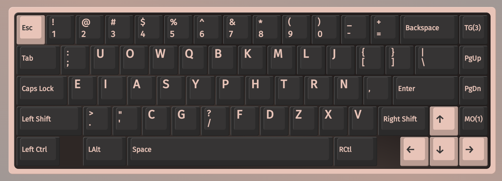
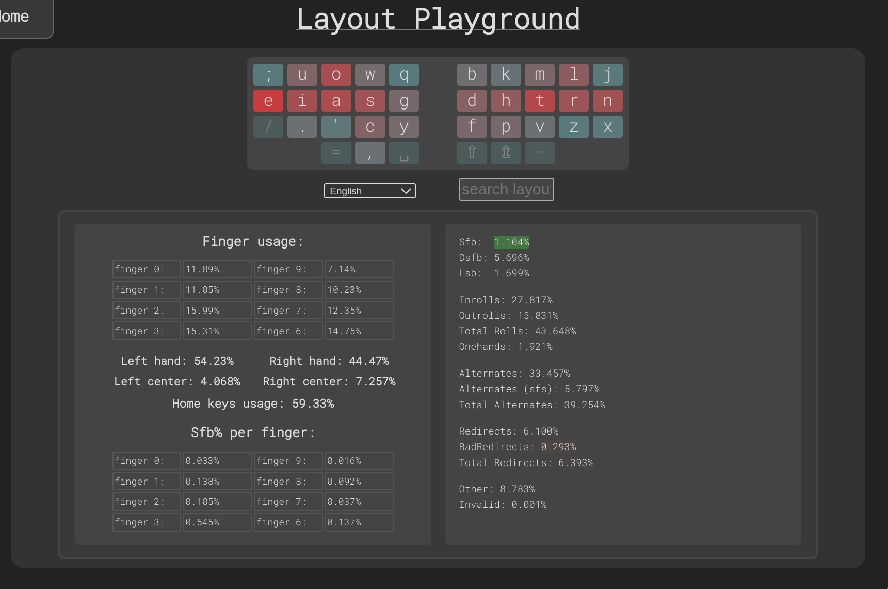
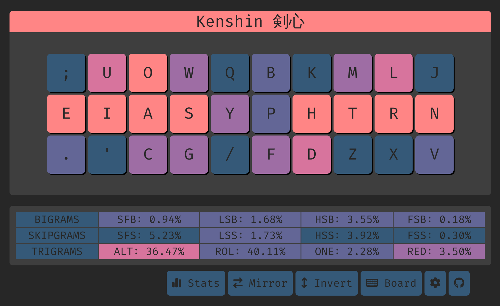

# Kenshin 剣心



## Features
- [angle modded](https://colemakmods.github.io/ergonomic-mods/angle.html) for row staggered (aka standard) keyboards
- same hand h/j/k/l
- low SFS (4.71% vs kuntem 4.87% on shai)
- comparatively high inrolls (26.18% vs rain 32.26% on shai) 
- high inrolls to outrolls ratio (1.689, close to golden ratio of 1.618)
- low pinky/ring scissors (0.26% vs nordrassils 0.24% and graphite 0.25% on cyaphonage)
- high alternation (32.22% vs graphite 33.79% on shai)
- unchanged `c` positions compared to qwerty
- alternate fingerings for `sy`, `cy` and perhaps harder but possible `gs` and `sw` with LM and LI fingers
- alternate fingerings for `ph` with RI and RM fingers
- `sc` (angle modded) sfbs can be an effortless sliding motion

**In short, all (top 10) sfbs are either altable or slidable, and all adjacent to each other**

## Top 10 SFBS on shai corpus
```
sc    0.115%
ui    0.104%
ys    0.103%
rl    0.074%
oa    0.072%
gs    0.059%
ph    0.058%
sy    0.043%
ws    0.041%
cy    0.030%
```

## Cmini

```
  ; u o w q  b k m l j
  e i a s y  p h t r n
   . ' c g /  f d z x v

SHAI:
  Alt: 32.22%
  Rol: 41.68%   (In/Out: 26.18% | 15.50%)
  One:  1.62%   (In/Out:  0.45% |  1.17%)
  Rtl: 43.30%   (In/Out: 26.62% | 16.68%)
  Red:  3.84%   (Bad:     0.15%)

  SFB: 1.12%
  SFS: 4.71%    (Red/Alt: 1.54% | 3.17%)

  LH/RH: 54.82% | 45.18%
```

## Cyanophage

[statistics](https://cyanophage.github.io/playground.html?lan=english&layout=%3Buowqbkmlj-eiasydptrn%2C.%27cg%2Ffhzxv%5C%5E&mode=iso)

## Oxeylyzer Playground (not yet updated)



## Keysolve



# Readings
- https://semilin.github.io/blog/2023/layout_quality.html
- https://getreuer.info/posts/keyboards/alt-layouts/index.html#which-alt-keyboard-layout-should-i-learn
- https://bit.ly/layout-doc-v2
- https://cyanophage.github.io/
