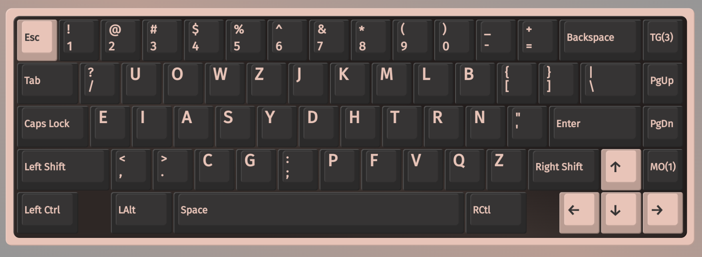

# Kenshin 剣心

## Features
- [angle modded](https://colemakmods.github.io/ergonomic-mods/angle.html) for row staggered (aka standard) keyboards
- same hand h/j/k/l
- low SFS (pro version 4.66% vs kuntem 4.87% on shai)
- comparatively high inrolls (pro version 27.11% vs rain 32.26% on shai) 
- high alternation (pro version 32.30% vs graphite 33.79% on shai)

**PRs welcome for other possible variants of kenshin :)**

## Variants

- [Kenshin lite](./lite.md)
- [Kenshin standard](./standard.md)
- [Kenshin pro](./pro.md)
- [Psych](./psych.md) (this is what I use)

# Readings
- https://semilin.github.io/blog/2023/layout_quality.html
- https://getreuer.info/posts/keyboards/alt-layouts/index.html#which-alt-keyboard-layout-should-i-learn
- https://bit.ly/layout-doc-v2
- https://cyanophage.github.io/
