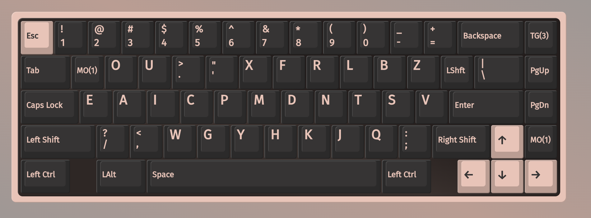
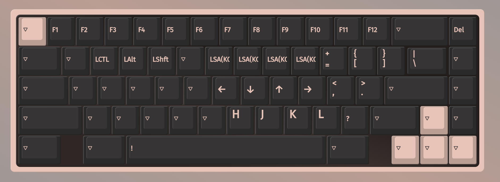
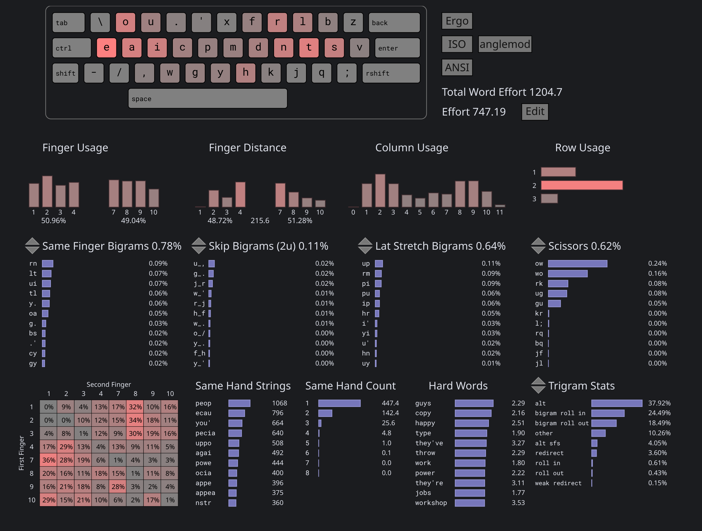

# Deuterium layout

## Main layer


## Symbol+Nav layer


## Cyanophage layout analyzer


[link (select "angle mod")](https://cyanophage.github.io/playground.html?lan=english&layout=%5Cou.%27xfrlbzeaicpmdntsv%2F%2Cwgyhkjq%3B-%5Eback&mode=iso&thumb=l)

## Benefits
- Very high efficiency due to very low SFBS, SFS (and redirect SFS). You would feel that all fingers are equally utilized
- `y` can be typed with either hand, depending on letter sequence. And this eliminates a lot of efficiency problems
- Sufficient alternation between hands and between fingers (**it is quite hard to achieve this**)
- Having many letters on the homerow
- High inrolls/outrolls ratio (outrolls can feel less natural if they are on the pinky/ring)
- Having hjkl on the same hand in a relatively natural positions (vim + tiling window managers)

## Design choices (some of it can be controversial)

#### Pushes frequent letters to the outer ring/pinky
This allows the index fingers to move inward reach inner column letters such as `y`, `p` and `x` more easily. In technical term, this reduces overall Lateral Stretch Bigrams (LSBs)

#### `E` being on the pinky position
I have `e` on pinky finger for almost a year, it is not really a problem. It may be a problem if `e` were to be on the right hand, as the right pinky has the additional burden of hitting BACKSPACE, ENTER, and punctuations.

#### Having H at the qwerty `n` position
H is somewhat frequent in common english, but there are several reasons I placed it there :
- it eliminates 2u (2 rows) jump on the index fingers
- it allows `why` to be typed in this sequence: Left index -> right index -> right index
- it prevents index finger from being curled up in the `k` (qwerty `m`) position, which makes `y`/`x` harder to reach

#### Right pinky having extra letters `z` and `v`
The `v` position may a dealbreaker for some, but they are not unreasonable because `v` is usually a skipgram with another consonants (exceptions being `r`, `n`, `l`). And most of the letters that interact heavily with `v` are assigned to index finger, so there's sufficient runway. `z` is in the most awkward position but it is the least frequent letter in english. 

```
SHAI
vr + rv: 0.06%
  vr: 0.00%
  rv: 0.06%
vl + lv: 0.03%
  vl: 0.00%
  lv: 0.03%
vn + nv: 0.05%
  vn: 0.00%
  nv: 0.05%
Total: 0.14%
```

```
SHAI
v_l + l_v: 0.25%
  v_l: 0.15%
  l_v: 0.10%
v_t + t_v: 0.16%
  v_t: 0.05%
  t_v: 0.11%
Total: 0.41%
```

## Cmini

``` 
deuterium
  _ o u . '  x f r l b z
   e a i c p  m d n t s v
    / , w g ȳ  h k j q ;  

SHAI:
  Alt: 33.10%
  Rol: 40.77%   (In/Out: 23.24% | 17.53%)
  One:  1.00%   (In/Out:  0.58% |  0.41%)
  Rtl: 41.77%   (In/Out: 23.82% | 17.94%)
  Red:  3.01%   (Bad:     0.15%)

  SFB:  0.76%
  SFS:  4.49%   (Red/Alt: 0.72% | 3.78%)

  LH/RH: 49.85% | 50.15%
```


# Readings
- https://semilin.github.io/blog/2023/layout_quality.html
- https://getreuer.info/posts/keyboards/alt-layouts/index.html#which-alt-keyboard-layout-should-i-learn
- https://bit.ly/layout-doc-v2
- https://cyanophage.github.io/


