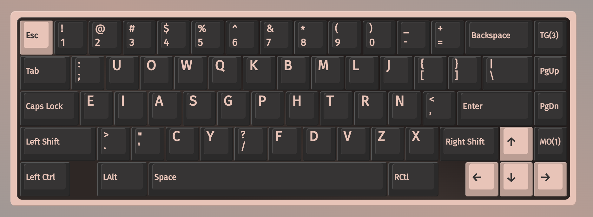
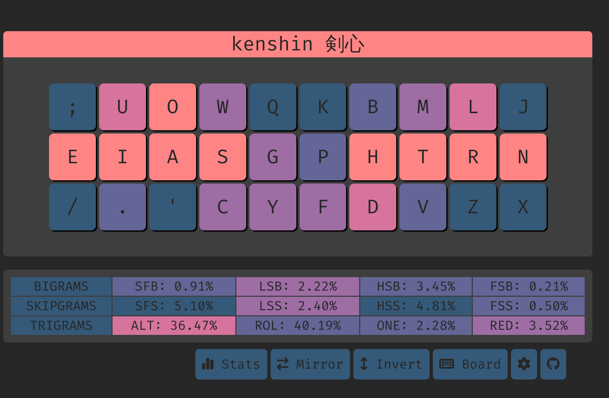

# Kenshin 剣心



## Features
- [angle modded](https://colemakmods.github.io/ergonomic-mods/angle.html) for row staggered (aka standard) keyboards
- same hand h/j/k/l
- high inrolls 
- low scissors
- high alternation
- unchanged `c` and `g` positions compared to qwerty
- alternate fingerings possible for `sy`, `sg`, `cg`, `cy` with LM and LI fingers
- alternate fingerings possible for `ph` with RI and RM fingers
- `sc` and `gy` sfbs can be an effortless downward motion due to angle mod

## Tips.

If you don't mind the `nk` sfbs/sfs on the pinky, you could swap `j` and `k` to reduce LSBs by **quite a lot**

## Top 10 SFBS on shai corpus
```
sc    0.115%
ui    0.104%
ys    0.103%
rl    0.074%
oa    0.072%
gs    0.059%
ph    0.058%
sy    0.043%
ws    0.041%
cy    0.030%
```

## Cmini

```
  ; u o w q  k b m l j
  e i a s g  p h t r n
   . ' c y /  f d v z x

SHAI:
  Alt: 32.27%
  Rol: 41.80%   (In/Out: 26.53% | 15.27%)
  One:  1.62%   (In/Out:  0.44% |  1.17%)
  Rtl: 43.42%   (In/Out: 26.98% | 16.44%)
  Red:  3.88%   (Bad:     0.16%)

  SFB: 1.06%
  SFS: 4.63%    (Red/Alt: 1.50% | 3.13%)

  LH/RH: 54.82% | 45.18%
```

## Cyanophage

[statistics](https://cyanophage.github.io/playground.html?lan=english&layout=%3Buowqkbmlj-eiasgphtrn%2C.%27cy%2Ffdvzx%5C%5E&mode=ansi) (statistics does not accurately reflect [angle mod](https://colemakmods.github.io/ergonomic-mods/angle.html))

## Oxeylyzer Playground


## Keysolve



# Readings
- https://semilin.github.io/blog/2023/layout_quality.html
- https://getreuer.info/posts/keyboards/alt-layouts/index.html#which-alt-keyboard-layout-should-i-learn
- https://bit.ly/layout-doc-v2
- https://cyanophage.github.io/
