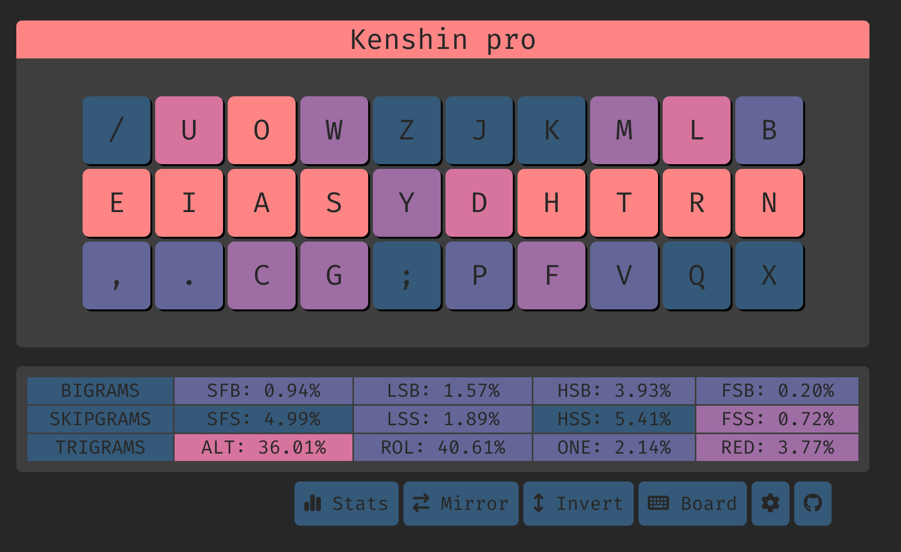

# Kenshin pro


# Features
- preserves qwerty c
- low sfs
- sfbs can be alted for:
  - ys (0.103%) 
  - gs (0.06%)
  - ph (0.058%)
  - sy (0.043%) 
  - ws (0.04%)
  - py+yp (0.03%)
  - cy (0.03%)


## Tips
- it is very natural to alt when `s` is at the end of the sequence
- `sc` is more difficult to alt due to sc[ao] taking up 0.05%(half of the SFBs). So it would be a sliding motion in practice, even though its possible to alt in my own experience
- for `sy`, it's trainable to alt when it is at the beginning (eg. system). But when it's in the middle (eg, `async`), it may be difficult (but it's really not too bad)

## Top 10 SFBS

```
sc    0.115%
ui    0.104%
ys    0.103%
rl    0.074%
oa    0.072%
gs    0.059%
ph    0.058%
sy    0.043%
ws    0.041%
cy    0.030%
```

## Cmini overview

```
  / u o w z  j k m l b
  e i a s y  d h t r n
   , . c g ;  p f v q x

SHAI:
  Alt: 32.30%
  Rol: 42.33%   (In/Out: 27.11% | 15.22%)
  One:  1.54%   (In/Out:  0.41% |  1.13%)
  Rtl: 43.88%   (In/Out: 27.52% | 16.35%)
  Red:  4.05%   (Bad:     0.19%)

  SFB: 1.05%
  SFS: 4.66%    (Red/Alt: 1.53% | 3.13%)

  LH/RH: 55.15% | 44.85%
```


## Cmini Fingerspeed

```
SHAI:
Unweighted Speed
    LP: 0.220
    LR: 5.290
    LM: 9.417
    LI: 19.617
    RI: 6.726
    RM: 3.881
    RR: 2.731
    RP: 0.959

Weighted Speed
    LP: 0.147
    LR: 1.469
    LM: 1.962
    LI: 3.567
    RI: 1.223
    RM: 0.809
    RR: 0.759
    RP: 0.639
```


## Cyanophage
[statistics](https://cyanophage.github.io/playground.html?lan=english&layout=%2Fuowzjkmlb-eiasydhtrn%27%2C.cg%3Bpfvqx%5C%5E&mode=iso)


## Keysolve


