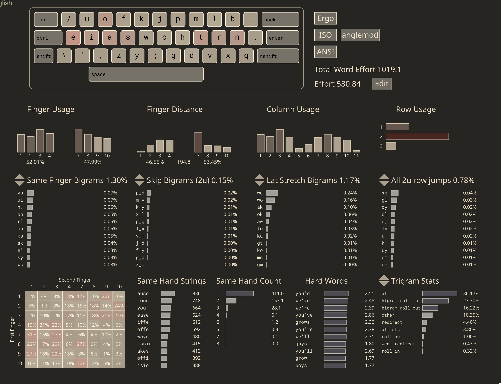
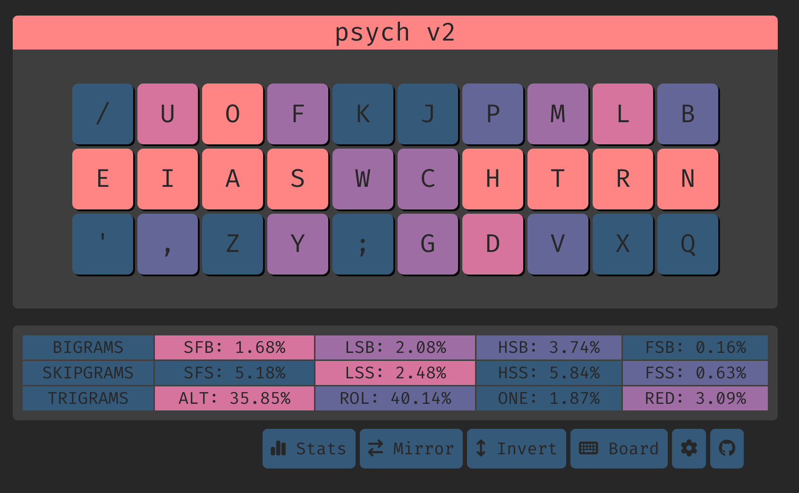

# Psych V2



[statistics](https://cyanophage.github.io/playground.html?lan=english&layout=%2Fuofkjpmlb-eiaswchtrn.%27%2Czy%3Bgdvxq%5C%5E&mode=iso)

Psych is basically kenshin, but with c moved to the right index. This blows up sfbs by a lot but they are all easily altable (ch, ck). 

## SFS tips
The SFS is already decent, but I've taken one step further by hitting the letter "d" with my RM finger, whenever d is the start of a word. This makes typing "deploy", "decode", "depends" a lot nicer.

As a result, when there's a sequence of letters that are like d->[mtv]->[rlq] (0.0194%), I would hit [mtv] with my RR finger and [rlq] with my RP, and the fingers reset when a redirect breaks the chain.

For eg, when typing "development":
- d: RM
- v: RR
- l: RP
- p: RI (resets)
- m: RM 
- and so on.

Examples of `^d([^jkchpdrlqbnx]*[mtv])+([^jkchpdmtvbnx]*[rlq])+` in SHAI:
```
157,676 / 81,369,938 words (0.194%)

development     (18764)
digital         (12488)
details         (10260)
develop         (9856)
developed       (9197)
determine       (7539)
developing      (6628)
district        (5596)
detailed        (4696)
determined      (4242)
```

In this approach, there will be a 10% chance of having pinky bigrams, which I think is acceptable.

Examples of `^d([^jkchpdrlqbnx]*[mtv])+([^jkchpdmtvbnx]*[rlq])+([^jkchpdmtvrlq]*[bnx])+` in SHAI:
```
11,689 / 81,369,938 words (0.014%)

distribution    (3496)
distributed     (1642)
distribute      (1020)
detailing        (642)
destroying       (638)
disturbing       (602)
distributor      (530)
distributing     (424)
distributions    (359)
distribution.    (351)
```


**Another, probably the better way is to memorize certain common words like deploy, depends, decode, and only use RM "d" for those words.**


## SFBs hand alternation?
Y can sometimes be typed using RI:
- "sys" can be typed this way: LI->RI->LI
- "async": LM->LI->RI->RP->RI
- similarly, "gy" and "zy" can be LI->RI
  
## Top 10 SFBS

```
ch    0.482%
gh    0.235%
ui    0.104%
ys    0.103%
n.    0.092%
rl    0.074%
oa    0.072%
ks    0.072%
ph    0.058%
sk    0.051%
```

## Cmini overview

```
  / u o f k  j p m l b  
  e i a s w  c h t r n .
   ' , z y ;  g d v x q  

SHAI:
  Alt: 32.37%
  Rol: 42.52%   (In/Out: 26.74% | 15.79%)
  One:  1.31%   (In/Out:  0.36% |  0.94%)
  Rtl: 43.83%   (In/Out: 27.10% | 16.73%)
  Red:  3.10%   (Bad:     0.19%)

  SFB: 1.84%
  SFS: 4.86%    (Red/Alt: 1.12% | 3.75%)

  LH/RH: 51.96% | 48.04%
```


## Cmini Fingerspeed

```
SHAI:
Unweighted Speed
    LP: 0.220
    LR: 5.462
    LM: 9.173
    LI: 11.735
    RI: 22.896
    RM: 3.881
    RR: 3.370
    RP: 2.934

Weighted Speed
    LP: 0.147
    LR: 1.517
    LM: 1.911
    LI: 2.134
    RI: 4.163
    RM: 0.809
    RR: 0.936
    RP: 1.956
```


## Keysolve


