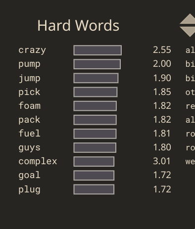
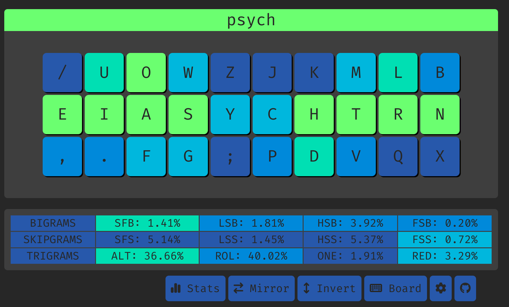

# Psych


Psych is basically kenshin, but with c moved to the right index. This blows up sfbs by a lot but they are all easily altable (ch, ck). 

## SFS Tips
The SFS is already decent, but I've taken one step further by hitting the letter "d" with my RM finger, whenever d is the start of a word. This makes typing "deploy", "decode", "depends" a lot nicer.

As a result, when there's a sequence of letters that are like d->[mtv]->[rlq] (0.0194%), I would hit [mtv] with my RR finger and [rlq] with my RP, and the fingers reset when a redirect breaks the chain.

For eg, when typing "development":
- d: RM
- v: RR
- l: RP
- p: RI (resets)
- m: RM 
- and so on.

Examples of `^d([^jkchpdrlqbnx]*[mtv])+([^jkchpdmtvbnx]*[rlq])+` in SHAI:
```
157,676 / 81,369,938 words (0.194%)

development     (18764)
digital         (12488)
details         (10260)
develop         (9856)
developed       (9197)
determine       (7539)
developing      (6628)
district        (5596)
detailed        (4696)
determined      (4242)
```

In this approach, there will be a 10% chance of having pinky bigrams, which I think is acceptable.

Examples of `^d([^jkchpdrlqbnx]*[mtv])+([^jkchpdmtvbnx]*[rlq])+([^jkchpdmtvrlq]*[bnx])+` in SHAI:
```
11,689 / 81,369,938 words (0.014%)

distribution    (3496)
distributed     (1642)
distribute      (1020)
detailing        (642)
destroying       (638)
disturbing       (602)
distributor      (530)
distributing     (424)
distributions    (359)
distribution.    (351)
```


**Another, probably the better way is to memorize certain common words like deploy, depends, decode, and only use RM "d" for those words.**

  
## Top 10 SFBS

```
ch    0.482%
ck    0.192%
ui    0.104%
ys    0.103%
rl    0.074%
oa    0.072%
gs    0.059%
ph    0.058%
sy    0.043%
ch    0.042%
```

## Cmini overview

```
  / u o w z  j k m l b
  e i a s y  c h t r n
   , . f g ;  p d v q x

SHAI:
  Alt: 32.85%
  Rol: 41.44%   (In/Out: 25.92% | 15.52%)
  One:  1.37%   (In/Out:  0.35% |  1.02%)
  Rtl: 42.81%   (In/Out: 26.27% | 16.54%)
  Red:  3.37%   (Bad:     0.19%)

  SFB: 1.56%
  SFS: 4.83%    (Red/Alt: 1.15% | 3.68%)

  LH/RH: 54.19% | 45.81%
```


## Cmini Fingerspeed

```
SHAI:
Unweighted Speed
    LP: 0.220
    LR: 5.290
    LM: 9.417
    LI: 11.750
    RI: 20.463
    RM: 3.881
    RR: 2.731
    RP: 0.959

Weighted Speed
    LP: 0.147
    LR: 1.469
    LM: 1.962
    LI: 2.136
    RI: 3.721
    RM: 0.809
    RR: 0.759
    RP: 0.639
```


## Cyanophage
[statistics](https://cyanophage.github.io/playground.html?lan=english&layout=%2Fuowzjkmlb-eiasychtrn%27%2C.fg%3Bpdvqx%5C%5E&mode=iso)



## Keysolve


