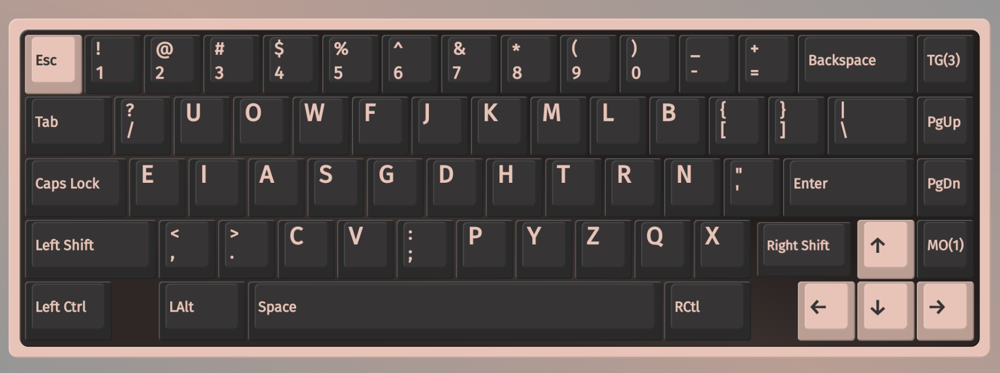
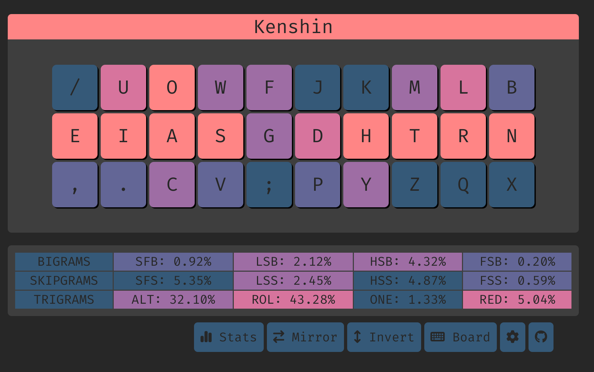

# Kenshin (standard)



# Features
- preserves qwerty c/v/g positions
- makes use of pinky e
- sfbs can be alted for:
  - gs (0.06%)
  - ph (0.058%)
  - dy (0.048%)
  - ws (0.04%)
  - py+yp (0.03%)

## Tips
- it is very natural to alt when `s` is at the end of the sequence
- `sc` is more difficult to alt due to sc[ao] taking up 0.05%(half of the SFBs). So it would be a sliding motion in practice, even though its possible to alt in my own experience
  
  
## Top 10 SFBS

```
sc    0.115%
ui    0.104%
rl    0.074%
oa    0.072%
gs    0.059%
ph    0.058%
dy    0.048%
ws    0.041%
hy    0.038%
tm    0.025%
```

## Cmini overview

```
  / u o w f  j k m l b
  e i a s g  d h t r n
   , . c v ;  p y z q x

SHAI:
  Alt: 29.01%
  Rol: 44.32%   (In/Out: 27.38% | 16.94%)
  One:  1.33%   (In/Out:  0.58% |  0.75%)
  Rtl: 45.65%   (In/Out: 27.96% | 17.69%)
  Red:  5.09%   (Bad:     0.19%)

  SFB: 0.99%
  SFS: 5.24%    (Red/Alt: 2.15% | 3.09%)

  LH/RH: 56.34% | 43.66%
```


## Cmini Fingerspeed

```
SHAI:
Unweighted Speed
    LP: 0.220
    LR: 5.290
    LM: 9.417
    LI: 25.709
    RI: 10.804
    RM: 2.701
    RR: 2.731
    RP: 0.959

Weighted Speed
    LP: 0.147
    LR: 1.469
    LM: 1.962
    LI: 4.674
    RI: 1.964
    RM: 0.563
    RR: 0.759
    RP: 0.639
```


## Cyanophage
[statistics](https://cyanophage.github.io/playground.html?lan=english&layout=%2Fuowfjkmlb-eiasgdhtrn%27%2C.cv%3Bpyzqx%5C%5E&mode=iso)


## Keysolve


