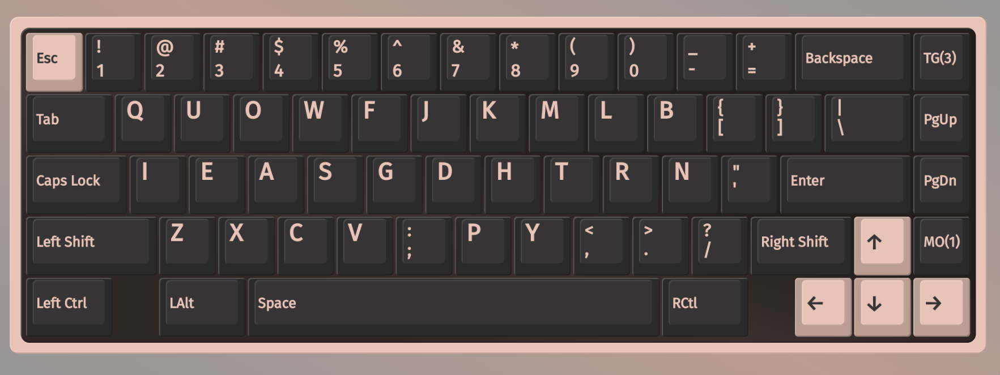
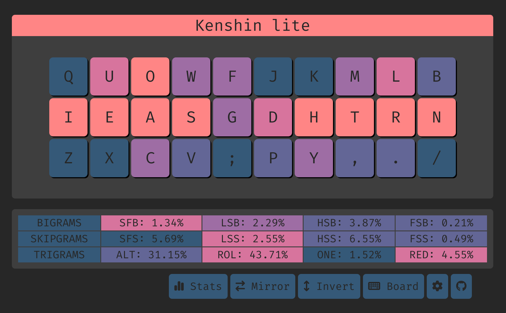

# Kenshin lite



# Features
- preserves qwerty zxcv, g and h.
- slightly lower alts

## Cmini overview

```
  q u o w f  j k m l b
  i e a s g  d h t r n
   z x c v ;  p y , . /

SHAI:
  Alt: 28.27%
  Rol: 44.55%   (In/Out: 27.57% | 16.98%)
  One:  1.49%   (In/Out:  0.82% |  0.67%)
  Rtl: 46.04%   (In/Out: 28.39% | 17.65%)
  Red:  4.71%   (Bad:     0.25%)

  SFB: 1.25%
  SFS: 5.46%    (Red/Alt: 2.46% | 3.00%)

  LH/RH: 54.62% | 45.38%
```


## Cmini Fingerspeed

```
SHAI:
Unweighted Speed
    LP: 0.420
    LR: 6.061
    LM: 5.456
    LI: 25.709
    RI: 10.804
    RM: 5.060
    RR: 6.887
    RP: 0.627

Weighted Speed
    LP: 0.280
    LR: 1.684
    LM: 1.137
    LI: 4.674
    RI: 1.964
    RM: 1.054
    RR: 1.913
    RP: 0.418
```


## Cyanophage

[statistics](https://cyanophage.github.io/playground.html?lan=english&layout=quowfbkmlj-ieasgdhtrn%27zxcv%3Bpy%2C.%2F%5C%5E&mode=iso)


## Keysolve


